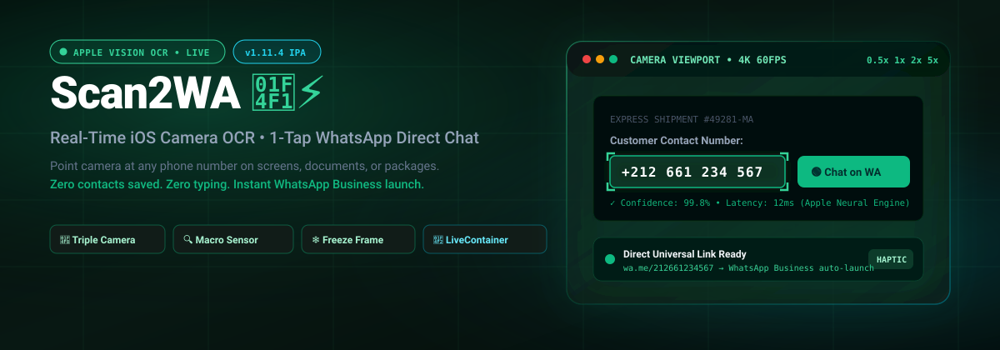

<p align="center">
  
</p>

<p align="center">
  <a href="https://github.com/ilyassbourass/Scan2WA/releases/latest"></a>
  
  
  
  
  
</p>

<p align="center">
  <strong>High-performance, on-device iOS camera OCR scanner designed for iPhone 15 Pro Max.</strong><br>
  Detects phone numbers from papers, shipping labels, and computer monitors in real-time — opening WhatsApp chats instantly in 1 tap without cluttering your address book.
</p>

---

## ⚡ Why Scan2WA?

| Traditional Annoying Flow | With Scan2WA 🚀 |
| :--- | :--- |
| 1. Read phone number from paper or screen | 1. Point iPhone camera at number |
| 2. Open Contacts app | 2. Tap detected green badge |
| 3. Tap `+`, type name, and paste phone number | 3. **Chat opens instantly in WhatsApp!** |
| 4. Open WhatsApp, pull to refresh contacts | ❌ **Zero contacts saved** |
| 5. Manually delete temporary contact weeks later | ❌ **Zero manual typing** |

---

## 🏗️ Real-Time Apple Vision Pipeline

Scan2WA processes 60 FPS live video feeds directly using Apple Neural Engine hardware acceleration without uploading any data to external servers:

```mermaid
flowchart LR
    A["📷 4K Camera Feed\n(Triple-Lens System)"] --> B["⚡ AVCaptureVideoDataOutput\n(Native CMSampleBuffer)"]
    B --> C["🧠 Apple Vision Framework\n(VNRecognizeTextRequest)"]
    C --> D["🔍 Phone Normalizer\n(Regex + Country Code Engine)"]
    D --> E["🎯 Interactive Bounding Box\n(Direct Viewport Overlay)"]
    E --> F["🟢 1-Tap Direct Launch\n(https://wa.me/...)"]

    style A fill:#0f172a,stroke:#38bdf8,stroke-width:2px,color:#f8fafc
    style B fill:#0f172a,stroke:#38bdf8,stroke-width:2px,color:#f8fafc
    style C fill:#1e1b4b,stroke:#818cf8,stroke-width:2px,color:#f8fafc
    style D fill:#064e3b,stroke:#34d399,stroke-width:2px,color:#f8fafc
    style E fill:#064e3b,stroke:#34d399,stroke-width:2px,color:#f8fafc
    style F fill:#022c22,stroke:#10b981,stroke-width:3px,color:#ffffff
```



---

## ✨ Key Features

- **Triple-Camera & Macro Auto-Switching**: Built with `AVCaptureDevice.builtInTripleCamera`. Bringing the phone close to documents or small font labels seamlessly engages the Ultra-Wide macro sensor.
- **Dedicated Zoom Presets**: Instant hardware switching:
  - `0.5x`: Ultra-Wide & Close-up Macro (business cards, parcel stickers)
  - `1.0x`: Primary 24mm Wide sensor
  - `2.0x`: Lossless 48mm Quad-Pixel crop
  - `5.0x`: Tetraprism 120mm optical zoom (scan numbers across the room or on high TV monitors)
- **Freeze Frame Mode**: Freeze moving or vibrating camera feeds with one tap to select phone numbers comfortably.
- **High-Power Torch**: Integrated flashlight toggle with variable brightness support for low-light warehouses.
- **Smart Prefix Normalization**: Automatically prepends regional prefixes (e.g. `+212`, `+1`, `+33`, `+44`) when scanning local 9-digit or 10-digit numbers starting with `0`.
- **Haptic Feedback**: Medium impact physical haptics (`UIImpactFeedbackGenerator`) confirm successful detection and taps.
- **Instant Fallbacks**: Long-press or secondary buttons allow instant **Direct Calling** or **Copy to Clipboard**.

---

## 📲 Installation Guide

### Option 1: LiveContainer (Recommended)
1. Download the latest **`Scan2WA.ipa`** from [Releases](https://github.com/ilyassbourass/Scan2WA/releases/latest).
2. Open **LiveContainer** on your iPhone.
3. Tap the **`+`** icon at the top right and select `Scan2WA.ipa`.
4. Tap **Scan2WA** to launch!

> [!TIP]
> **LiveContainer Source URL**: You can add Scan2WA as a persistent source in LiveContainer using:  
> `https://raw.githubusercontent.com/ilyassbourass/Scan2WA/main/apps.json`

### Option 2: TrollStore, AltStore, or SideStore
- Simply sideload the unsigned `Scan2WA.ipa` using TrollStore, AltStore, SideStore, or Sideloadly.

---

## 🛠️ Building From Source

```bash
# 1. Clone repository
git clone https://github.com/ilyassbourass/Scan2WA.git
cd Scan2WA

# 2. Generate Xcode project via XcodeGen
xcodegen generate

# 3. Open in Xcode
open Scan2WA.xcodeproj
```

Automated cloud compilation is configured with GitHub Actions (`.github/workflows/build_ipa.yml`) on macOS runners.

---

## 📄 License

This project is licensed under the [MIT License](LICENSE).
